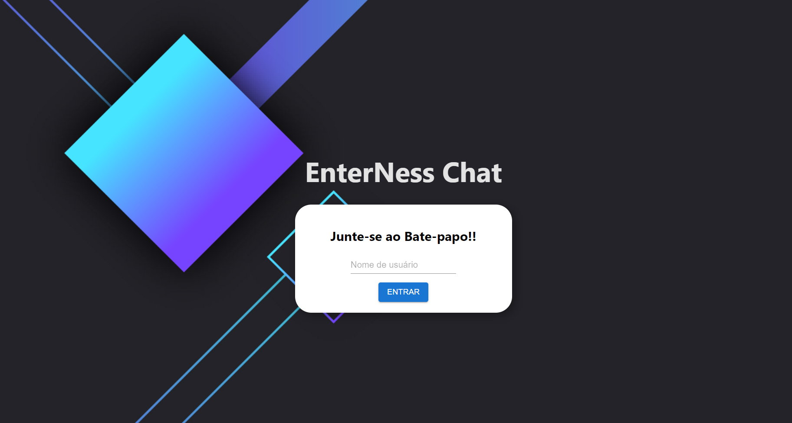
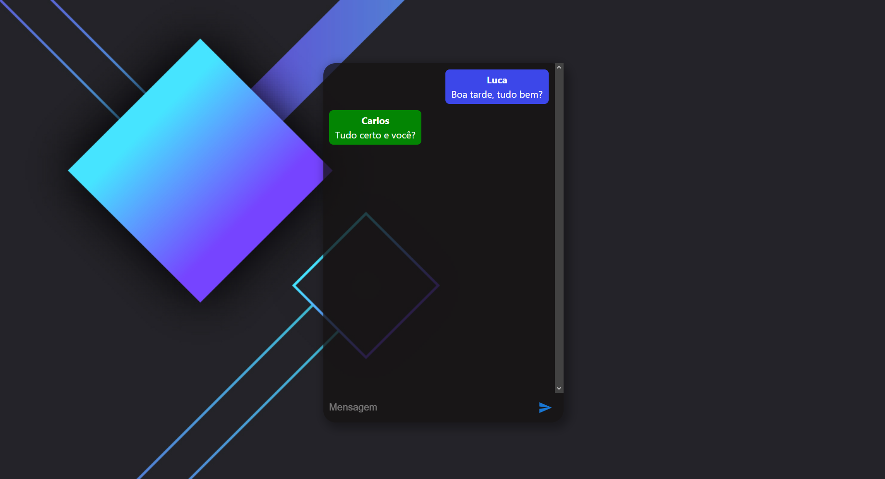

# Chat RealTime EnterNess

Projeto teste para EnterNess

### 📋 Pré-requisitos

Necessário clonar o repositorio e navegar pelas pastas "Server" e "Client"
Utilizar dois terminais, um para o client e outro para o server.

### 🔧 Instalação de dependências

`npm install` (Nos dois diretórios: client e server)

### ⚙️ Para inicializar o Programa
`npm run start-dev`

### ⚙️ Pré Visualização

## 🛠️ Construído com: 

* [Express](https://expressjs.com/pt-br/) - Framework Node utilizado para criar o servidor
* [Vite](https://vitejs.dev) - Biblioteca React
* [Nodemon](https://www.npmjs.com/package/nodemon) - Reinicialização automática na alteração de algum arquivo
* [TypeScript](https://www.typescriptlang.org/) - Linguagem utilizada
* [ts-node](https://www.npmjs.com/package/ts-node) - Vai transformar o TypeScript em JavaScript e executar usando o próprio Node.

## ✒️ Autores

* **Luca Carinhena** - *NodeJs Developer* - (https://github.com/Lucarinhena)  (https://www.linkedin.com/in/luca-carinhena)

---
⌨️ com ❤️ por [Luca Carinhena] 😊